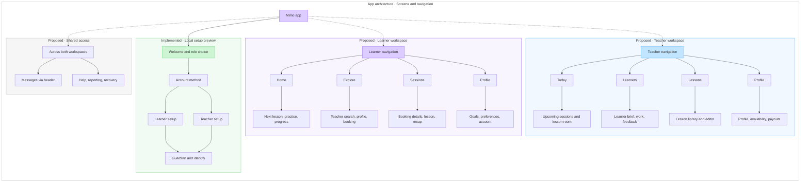
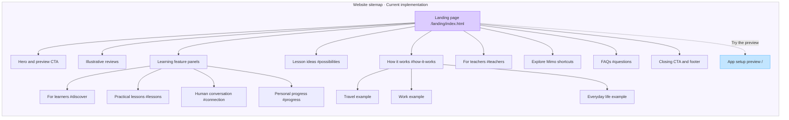

# Mimo app architecture and website sitemap

Created 9 October 2026 in the existing FigJam file. User confirmed architecture means screens and navigation.

- Collection: https://www.figma.com/board/AYNNAqQDARTmwlsa6AYHsd?node-id=484-3607
- App architecture: https://www.figma.com/board/AYNNAqQDARTmwlsa6AYHsd?node-id=482-3564
- Website sitemap: https://www.figma.com/board/AYNNAqQDARTmwlsa6AYHsd?node-id=480-3392

## Scope and sources

App hierarchy combines the implemented local onboarding in app/src/onboarding.ts and app/src/Prototype.tsx with the proposed home navigation documented in context.md and the goal-based user flows. Learner tabs: Home / Explore / Sessions / Profile. Teacher tabs: Today / Learners / Lessons / Profile. Messages are accessed from the header. Diagram layout is hierarchical, not tab display order or chronological task order. Leaf boxes group related screens. Proposed areas are explicitly labeled; no downstream workspace is implemented by this task. Guardian handling applies to under-18 learners; teachers use identity only. Account, guardian and identity steps are simulations.

Website hierarchy is sourced from app/public/landing/index.html and landing.js. One landing page at /landing/index.html; hash labels are anchors in that page. Travel, Work and Everyday life are interactive examples, not routes. Preview CTAs link to the onboarding app at /. No additional website routes were invented.

## Verification

Both diagrams and their collection screenshot were visually inspected. Added internal implementation-status headings after initial render. 45 editable shape nodes and 44 connectors; no dangling connector endpoints or out-of-section content in the structural check. The final heading positions fit the existing 48px group inset. Existing board content was preserved. No app code changed or runtime tests run.

Local screenshots: overview.png, app-architecture.png, website-sitemap.png. The app screenshot includes implementation-status headings added after Mermaid generation.

## App architecture Mermaid

## Website sitemap Mermaid

