# Additional teacher user flows

Created 9 October 2026. One goal per flow.

[FigJam collection](https://www.figma.com/board/AYNNAqQDARTmwlsa6AYHsd?node-id=466-3308)

Added beside the user-rearranged teacher section; its existing content was preserved. Proposed behavior is not implemented. Identity is only the current simulated preview, and payout policies remain open.

## T4 · Set my availability

Status: Proposed

Entry: Teacher profile is ready

Boundary: Every slot is one-to-one. Changing availability must preserve existing bookings.

[FigJam flow](https://www.figma.com/board/AYNNAqQDARTmwlsa6AYHsd?node-id=452-2685)

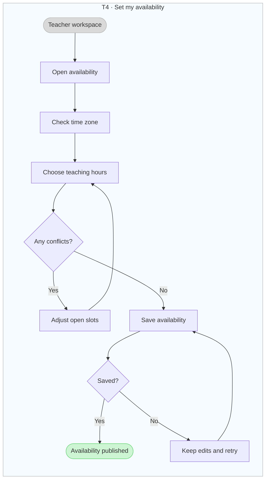

## T5 · Share a prepared lesson

Status: Proposed

Entry: An approved lesson for one chosen learner

Boundary: Check the recipient and learner view. Keep private notes private and preserve past lesson versions.

[FigJam flow](https://www.figma.com/board/AYNNAqQDARTmwlsa6AYHsd?node-id=453-2743)

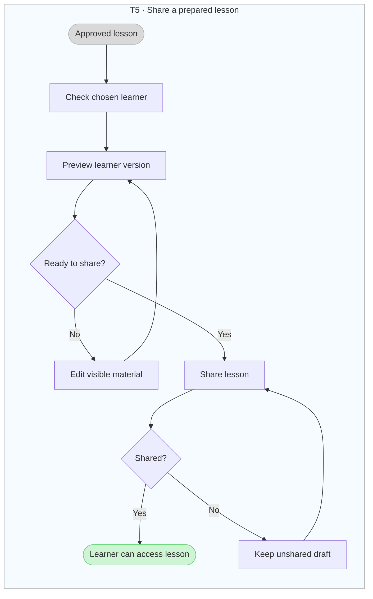

## T6 · Teach an online lesson

Status: Proposed

Entry: A confirmed online session

Boundary: One teacher and one learner. If the learner does not arrive, use the separate no-show flow.

[FigJam flow](https://www.figma.com/board/AYNNAqQDARTmwlsa6AYHsd?node-id=454-2799)

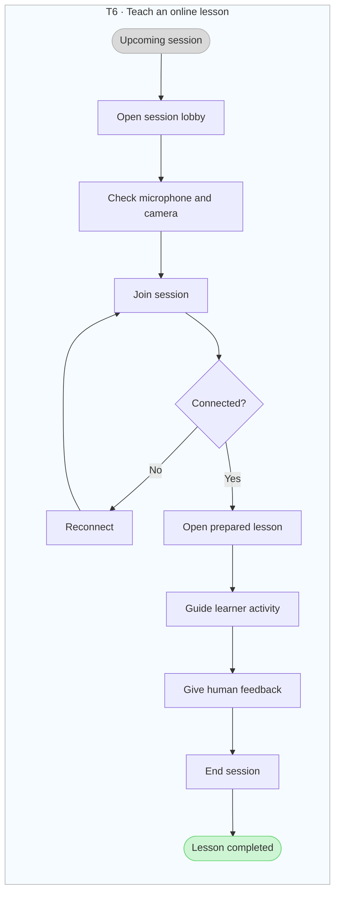

## T7 · Review a learner submission

Status: Proposed

Entry: A submitted recording or written response

Boundary: Teacher review works without AI. Final feedback is private and teacher-approved.

[FigJam flow](https://www.figma.com/board/AYNNAqQDARTmwlsa6AYHsd?node-id=455-2848)

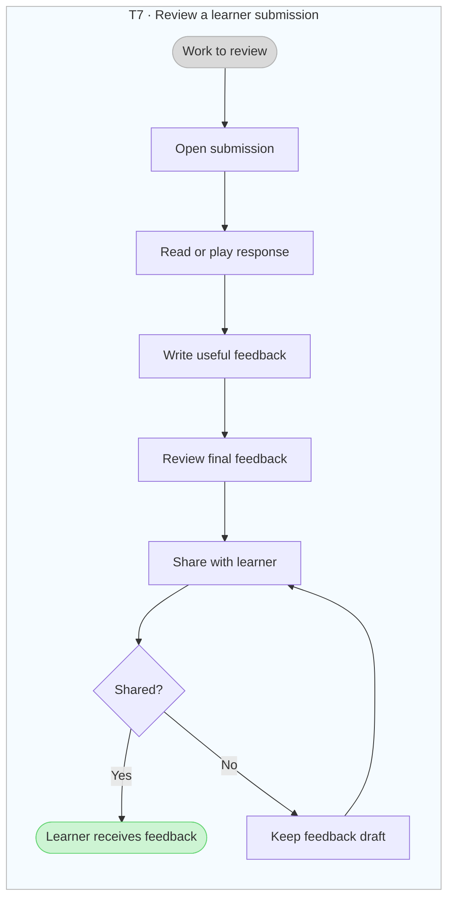

## T8 · Create a reusable lesson

Status: Proposed

Entry: Teacher lesson library

Boundary: Short modular lessons, not long courses. Saving to the library does not share with a learner.

[FigJam flow](https://www.figma.com/board/AYNNAqQDARTmwlsa6AYHsd?node-id=456-2898)

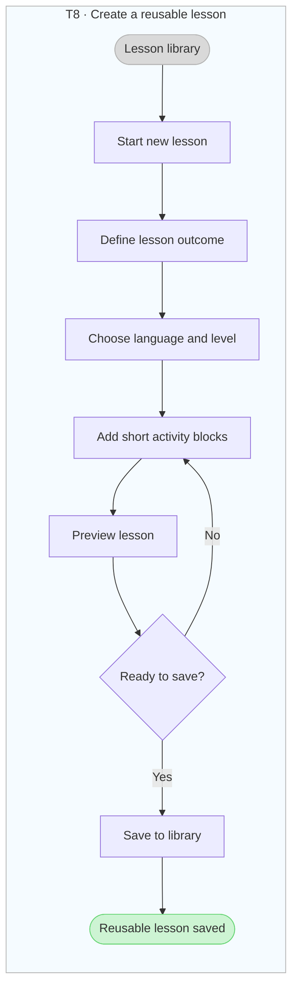

## T9 · Adapt a saved lesson

Status: Proposed

Entry: A saved lesson and a learner goal brief

Boundary: Creates a learner-specific draft. Keep the original reusable lesson and previous session versions.

[FigJam flow](https://www.figma.com/board/AYNNAqQDARTmwlsa6AYHsd?node-id=457-2946)

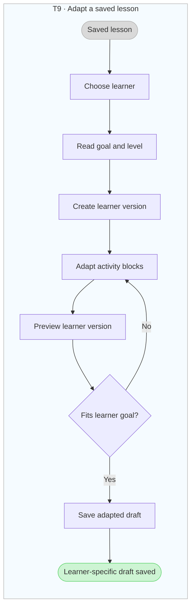

## T10 · Reschedule a session

Status: Proposed

Entry: An upcoming confirmed session

Boundary: Keep the original booking until replacement confirmation. Agreement rules and charges remain open.

[FigJam flow](https://www.figma.com/board/AYNNAqQDARTmwlsa6AYHsd?node-id=458-2994)

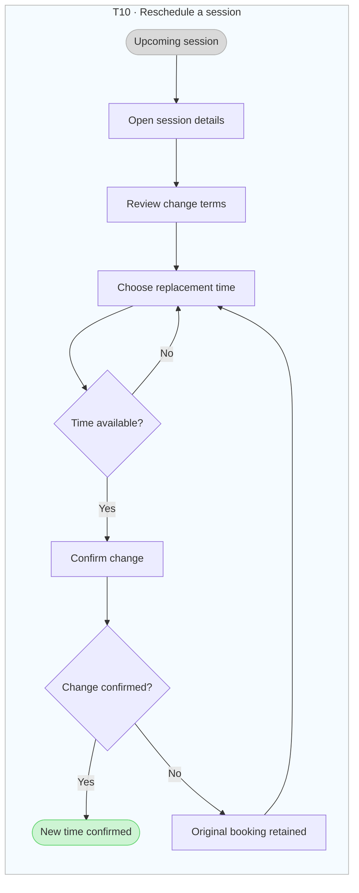

## T11 · Cancel a session

Status: Proposed

Entry: An upcoming booking

Boundary: Show the actual applicable consequences before confirmation. Fees, refunds and deadlines are undecided.

[FigJam flow](https://www.figma.com/board/AYNNAqQDARTmwlsa6AYHsd?node-id=459-3042)

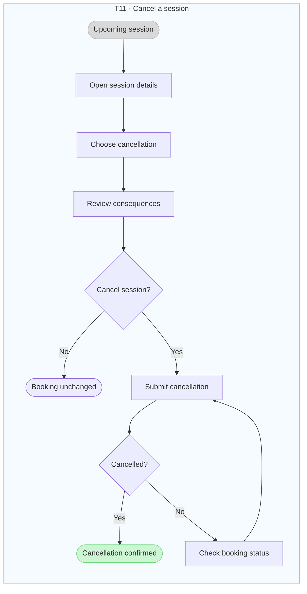

## T12 · Report a learner no-show

Status: Proposed

Entry: A scheduled session where the learner has not arrived

Boundary: The outcome is a recorded issue and next step, not a refund or fault decision. Waiting thresholds remain open.

[FigJam flow](https://www.figma.com/board/AYNNAqQDARTmwlsa6AYHsd?node-id=460-3089)

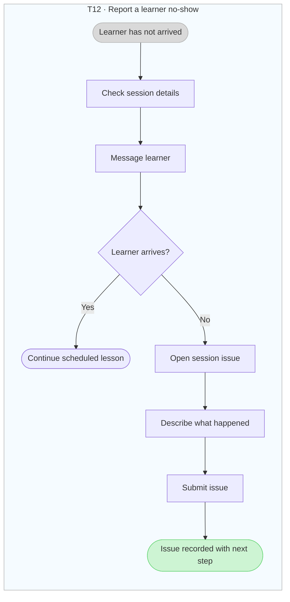

## T13 · Message a learner

Status: Proposed

Entry: An existing learner or session conversation

Boundary: Private lesson communication. A failed send remains an editable draft and is never shown as delivered.

[FigJam flow](https://www.figma.com/board/AYNNAqQDARTmwlsa6AYHsd?node-id=462-3128)

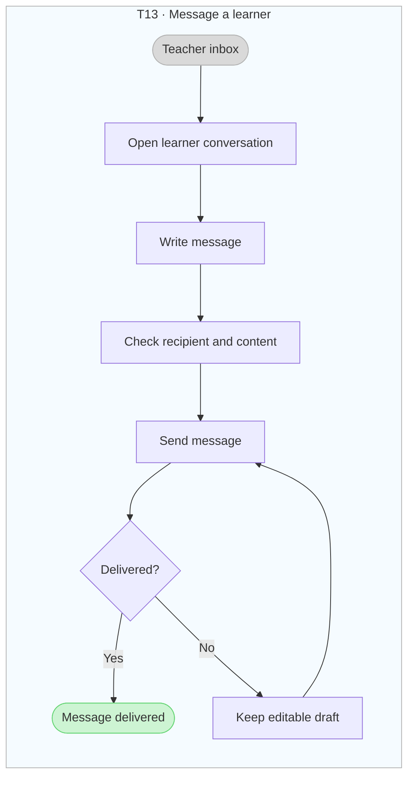

## T14 · Update my teaching profile

Status: Proposed

Entry: An existing teaching profile

Boundary: Public teaching details are separate from legal identity data. Existing booking terms are preserved.

[FigJam flow](https://www.figma.com/board/AYNNAqQDARTmwlsa6AYHsd?node-id=463-3171)

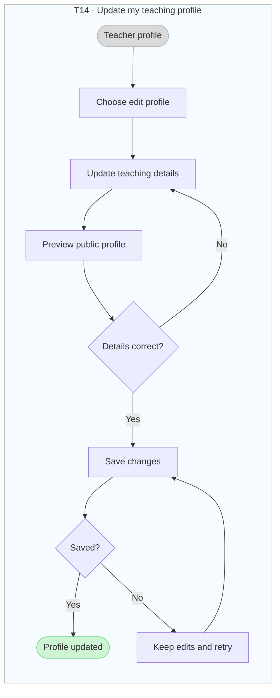

## T15 · Complete the identity preview

Status: Current simulated prototype

Entry: Teacher profile review

Boundary: No real identity check, camera, upload or Persona connection. Identity is separate from teaching qualification.

[FigJam flow](https://www.figma.com/board/AYNNAqQDARTmwlsa6AYHsd?node-id=464-3231)

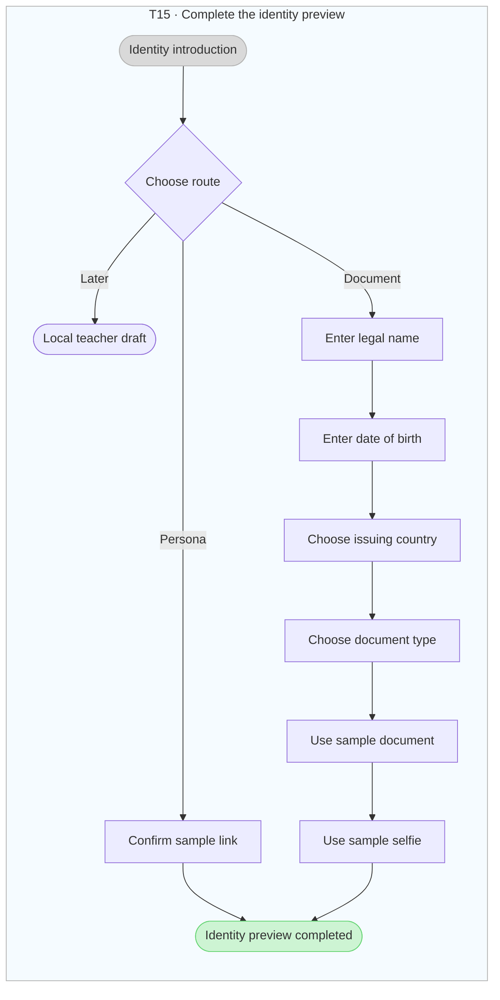

## T16 · Receive a payout

Status: Concept · policies open

Entry: Earnings from completed paid sessions

Boundary: Provider, fees, timing and automatic versus requested payouts are undecided. Pending is not failed; never duplicate a transfer.

[FigJam flow](https://www.figma.com/board/AYNNAqQDARTmwlsa6AYHsd?node-id=465-3279)

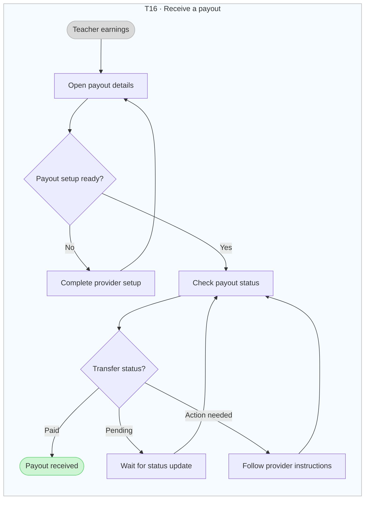

