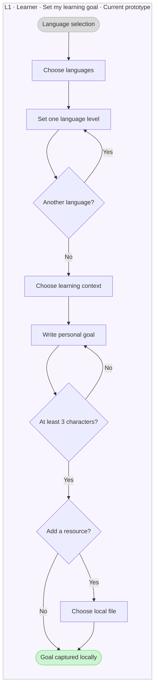
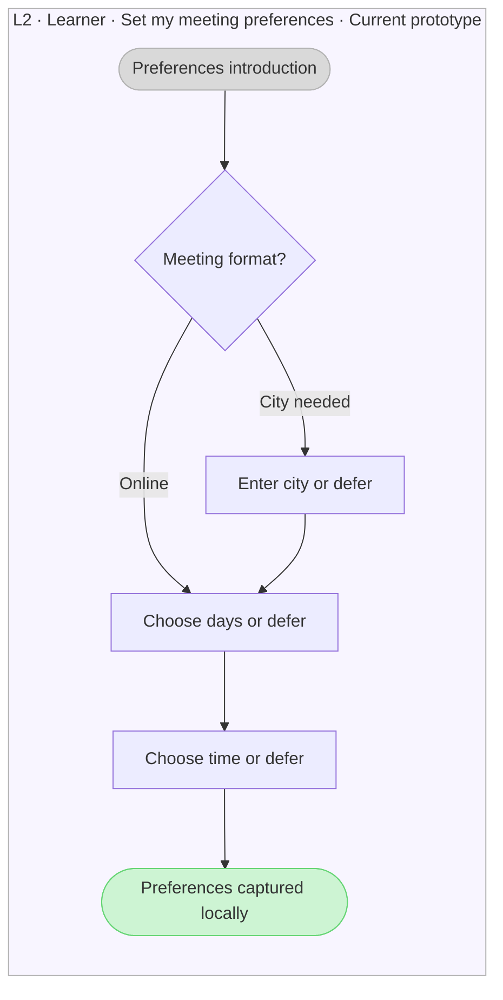
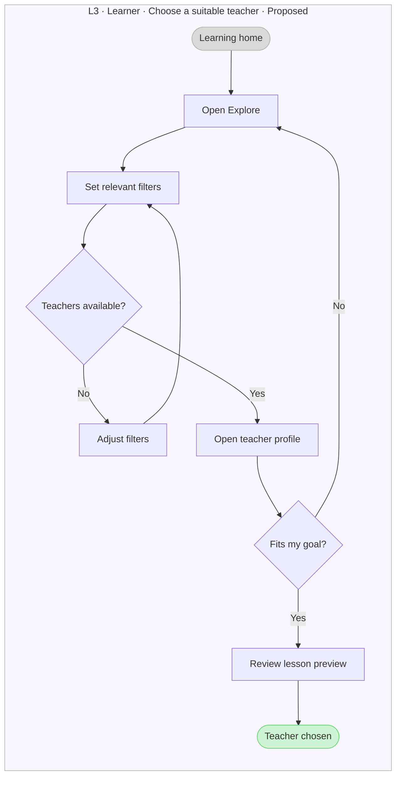
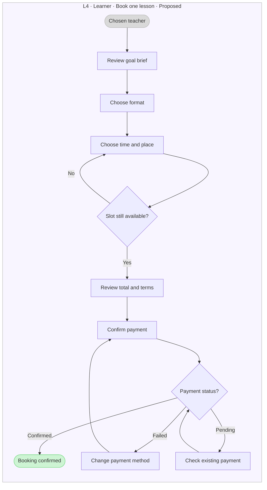
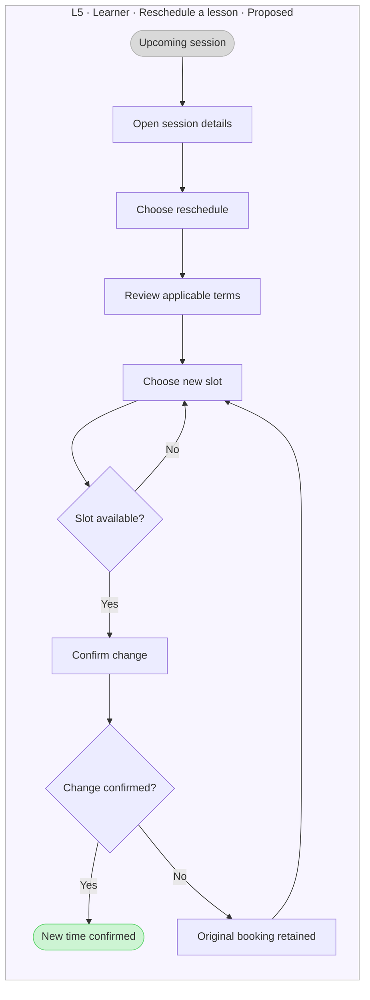
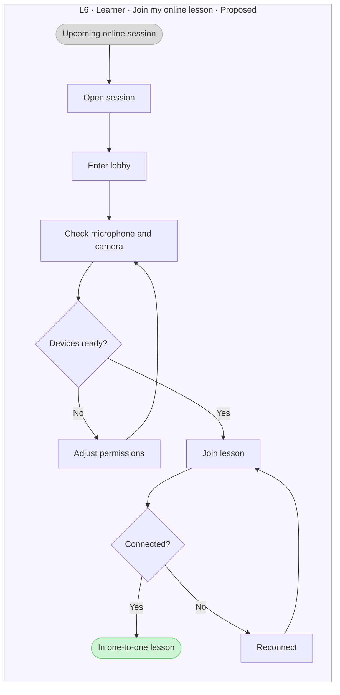
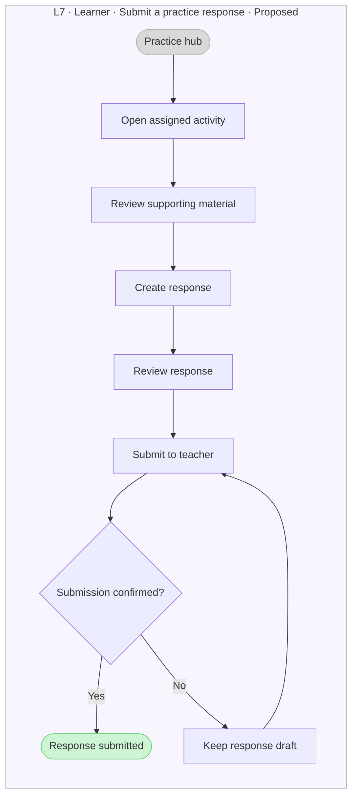
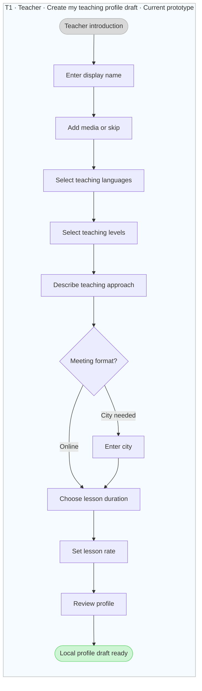
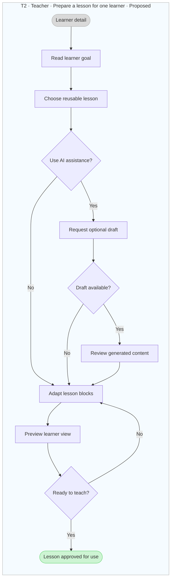
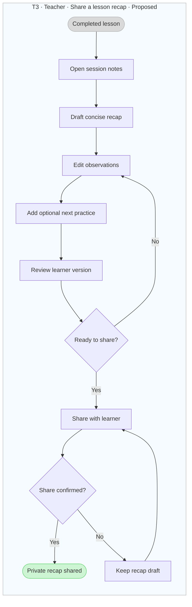

# Mimo user flows

Created 9 October 2026. One flow = one goal.

[Open FigJam collection](https://www.figma.com/board/AYNNAqQDARTmwlsa6AYHsd?node-id=440-2676)

## L1 · Set my learning goal

- Role: Learner
- Status: Current prototype
- Entry: Learner setup after account and any guardian handoff
- Boundary: Local page-session state only. Account and guardian checks are simulated.
- [FigJam flow](https://www.figma.com/board/AYNNAqQDARTmwlsa6AYHsd?node-id=428-2182)

## L2 · Set my meeting preferences

- Role: Learner
- Status: Current prototype
- Entry: After learning goal and encouragement
- Boundary: Online skips city. Days and times can stay flexible; no daily target.
- [FigJam flow](https://www.figma.com/board/AYNNAqQDARTmwlsa6AYHsd?node-id=430-2226)

## L3 · Choose a suitable teacher

- Role: Learner
- Status: Proposed
- Entry: Learning home with goal brief
- Boundary: Learner chooses the teacher. No automatic assignment or assumed public ratings.
- [FigJam flow](https://www.figma.com/board/AYNNAqQDARTmwlsa6AYHsd?node-id=431-2265)

## L4 · Book one lesson

- Role: Learner
- Status: Proposed
- Entry: Chosen teacher and lesson
- Boundary: Price, fees and cancellation rules remain undecided. Pending payment is not failure.
- [FigJam flow](https://www.figma.com/board/AYNNAqQDARTmwlsa6AYHsd?node-id=432-2319)

## L5 · Reschedule a lesson

- Role: Learner
- Status: Proposed
- Entry: An existing upcoming booking
- Boundary: Any eligibility or fee rules need definition. Keep the original booking until change confirmation.
- [FigJam flow](https://www.figma.com/board/AYNNAqQDARTmwlsa6AYHsd?node-id=433-2377)

## L6 · Join my online lesson

- Role: Learner
- Status: Proposed
- Entry: A confirmed online booking
- Boundary: One learner and one chosen teacher. Connection and permissions are not implemented.
- [FigJam flow](https://www.figma.com/board/AYNNAqQDARTmwlsa6AYHsd?node-id=434-2430)

## L7 · Submit a practice response

- Role: Learner
- Status: Proposed
- Entry: A teacher-provided practice activity
- Boundary: Practice is optional. A failed upload stays a draft; it is not shown as submitted.
- [FigJam flow](https://www.figma.com/board/AYNNAqQDARTmwlsa6AYHsd?node-id=435-2480)

## T1 · Create my teaching profile draft

- Role: Teacher
- Status: Current prototype
- Entry: Teacher introduction after the simulated account step
- Boundary: Stops at profile review. Identity preview is a separate next goal; no profile is published.
- [FigJam flow](https://www.figma.com/board/AYNNAqQDARTmwlsa6AYHsd?node-id=436-2534)

## T2 · Prepare a lesson for one learner

- Role: Teacher
- Status: Proposed
- Entry: A booked learner and their goal brief
- Boundary: Short editable blocks. AI is optional; the teacher reviews and approves all content.
- [FigJam flow](https://www.figma.com/board/AYNNAqQDARTmwlsa6AYHsd?node-id=437-2591)

## T3 · Share a lesson recap

- Role: Teacher
- Status: Proposed
- Entry: A completed one-to-one lesson
- Boundary: Teacher is the final reviewer. Failed sharing preserves a draft; feedback stays private.
- [FigJam flow](https://www.figma.com/board/AYNNAqQDARTmwlsa6AYHsd?node-id=438-2652)

